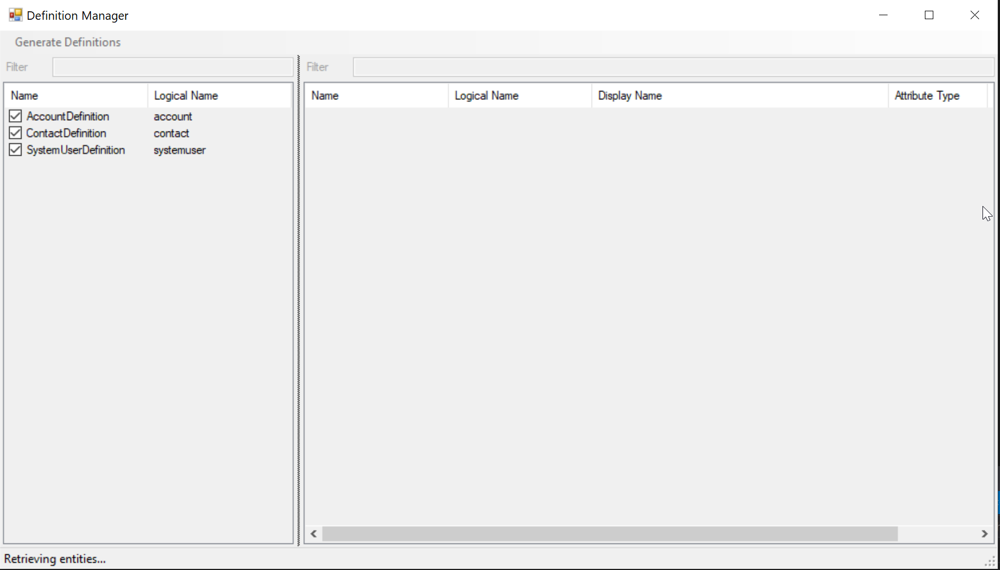
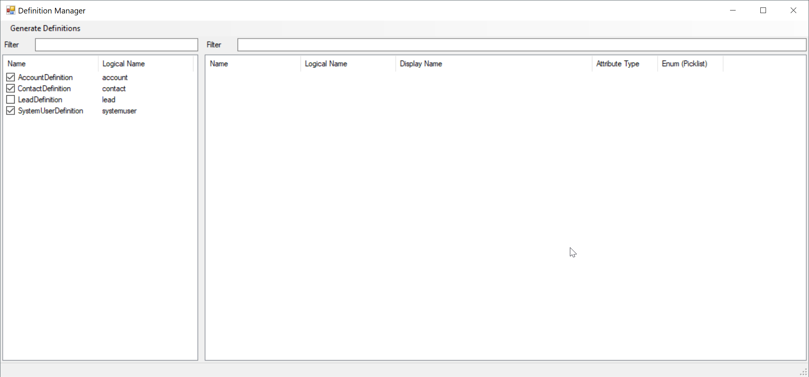
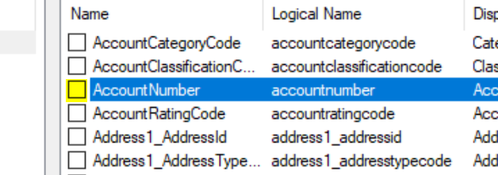
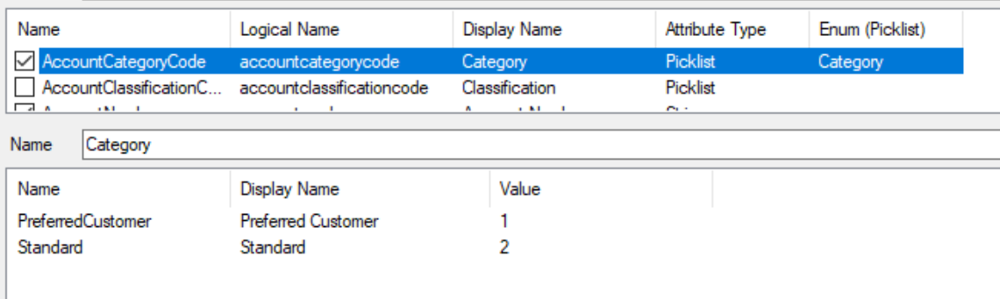
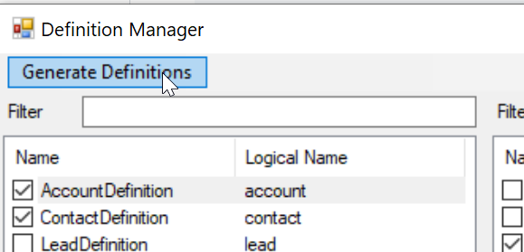

# Xrm Framework 
This project is a compilation of tools and design pattern that has been used on several Microsoft Services Dynamics 365 projects.

## Design Pattern
Several design pattern are included in this framework :
1.	Definition of Services to access CRM Data from Plugins or external code (Webservices, console apps, ...)
2.	Automatic Plugin Step registration from source code (use of attributes to describe plugin and plugin steps)
3.	Advanced plugin traces (service calls are logged)
4.  Metadata Definition extraction tool (no more plain string attribute references)

## Quick start

### Set configuration informations
Add a `connectionStrings.config` file as follows in the `Config\` folder near `App.config` (you can copy ``connectionStrings.sample`` to start you file)
```xml

  <connectionStrings>
    <!-- You must specify here the connection string to your environment
         You can specify several connection strings, you will select the one corresponding to the deployment
         environnement in the xrmFramework selectedConnection attribute below    
    -->
    <add name="Xrm" connectionString="AuthType=Office365; Url=https://yourorg.crm4.dynamics.com; Username=****@***.**; Password=*****"/>
  </connectionStrings>

```
The ``connectionStrings.config`` file is added to the .gitignore so your connectionString will not be sent to the repository and each developer can use his credentials.

Edit the `App.config` file in the ``Config`` solution folder to configure the connection to Dynamics 365 and the configuration of project deployments.

Define the connection string to Dynamics 365

You can specify several connection strings and pick the one to use in deployment tools by modifying the attribute `selectedConnection` 
```xml
<xrmFramework selectedConnection="Xrm">
    ...    
</xrmFramework>
```

Specify the solution unique name of the solution that is holding the entities in your Dynamics 365 implementation.
```xml
<entitySolution name="EntitiesSolutionUniqueName" />
```

Define project list you have in your solution and the corresponding deployment target solution

```xml

<projects>
    <add name="Plugins" targetSolution="PluginsSolutionUniqueName" type="PluginsWorkflows" />
    <add name="Workflows" targetSolution="WorkflowsSolutionUniqueName" type="PluginsWorkflows" />
    <add name="Webresources" targetSolution="WebResourcesSolutionUniqueName" type="WebResources" />
</projects>

```

## Generate model definitions
Launch the executable `DefinitionManager.exe` in the Deploy solution folder ( you can set the project as Startup project and run it pressing Ctrl + F5 )



The program retrieves all the entities that are referenced in you entities solution.

The definitions already added to you solution will be automatically selected.



You can select attributes to add them to already generated definitions or select new entities to generate definition files for them.



Optionset attributes, when selected, generate corresponding enums



```csharp
	[OptionSetDefinition(AccountDefinition.EntityName, AccountDefinition.Columns.AccountCategoryCode)]
	public enum Category
	{
		Null = 0,
		[Description("Preferred Customer")]
		PreferredCustomer = 1,
		[Description("Standard")]
		Standard = 2,
	}
```

When you have finished selecting the needed elements you can click on the "Generate Definitions" button.



The ``Model`` is now updated with the definitions you chose

## Create your first plugin

Implement a plugin using the `Plugin` base class.

```csharp
using Model;
using Plugins;

public class SamplePlugin : Plugin
{
    ...
}

```

### Defining Steps to register

Implement the ``AddSteps`` method to define the steps that this plugin will manage

```csharp
    protected override void AddSteps()
    {
        AddStep(Stages.PreValidation, Messages.Create, Modes.Synchronous, AccountDefinition.EntityName, nameof(Method1));
        AddStep(Stages.PreValidation, Messages.Update, Modes.Synchronous, AccountDefinition.EntityName, nameof(Method1));

        AddStep(Stages.PostOperation, Messages.Update, Modes.Synchronous, AccountDefinition.EntityName, nameof(Method2));
    }

```

### Adding details to the registered steps
For each method that you reference you can specify several information using method attributes :

```csharp
   
    [PreImage(AccountDefinition.Columns.Name)]
    [PostImage(AccountDefinition.Columns.Name)]
    [FilteringAttributes(AccountDefinition.Columns.Name, AccountDefinition.Columns.AccountNumber)]
    [ExecutionOrder(100)]
    public void Method(...)

```

- ``PreImageAttribute`` is used to define the fields that will be added in the preImage that will be registered

- ``PostImageAttribute`` is used to define the fields that will be added in the postImage that will be registered

- ``FilteringAttributesAttribute`` is used to define on which attribute change the method should launch

- ``ExecutionOrderAttribute`` allows specifying the execution order that will be registered

### Choosing method arguments

```csharp
public void Method(IPluginContext context, IAccountService accountService, ...)
```

# Contribute
The code is currently on production on several big project but is not at all finished. If you have time and motivation to contribute to it you are welcome to make pull requests. Il will study them and include the changes in this repo. 
