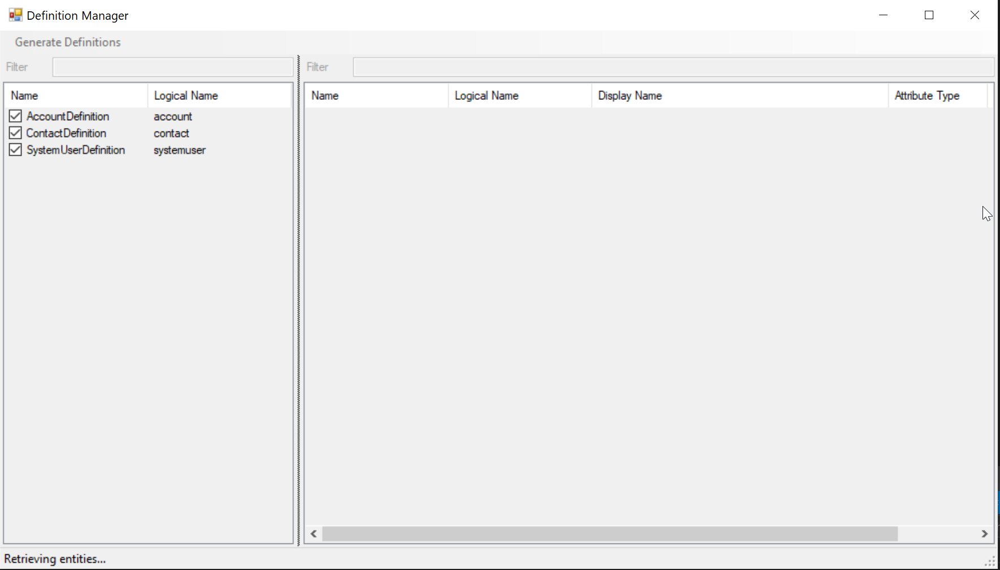
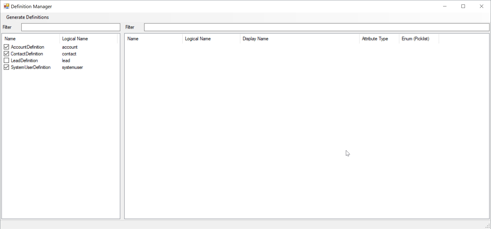
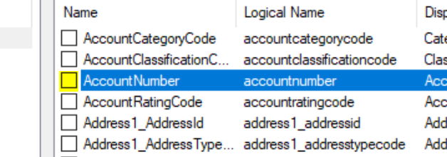
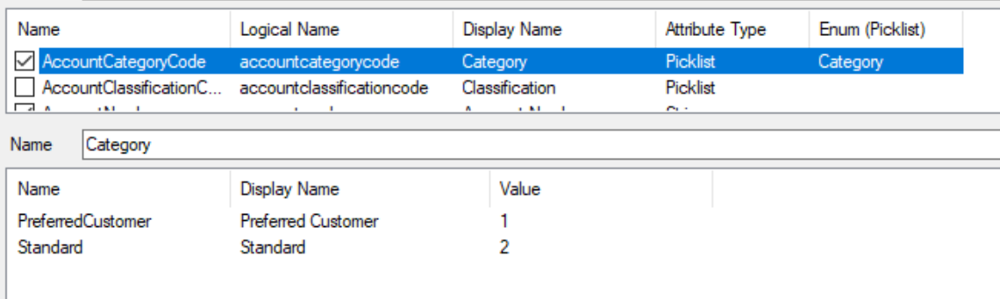
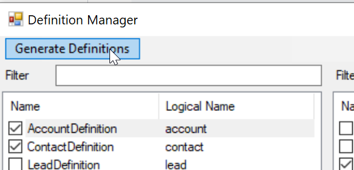

<div align="center">

# Xrm Framework

**The productivity framework that makes Dynamics 365 / Dataverse development feel like modern .NET.**

Strongly-typed models, declarative plugin registration, one-click deployment and a real remote debugger — distilled from 15+ years of building production Dynamics 365 / Dataverse solutions.

[](https://www.nuget.org/packages/XrmFramework.Templates)
[](https://www.nuget.org/packages/XrmFramework)
[](LICENSE.txt)
[](#)
[](#contribute)

</div>

---

## Why XrmFramework?

Dynamics 365 / Dataverse plugin development is famous for its friction: magic strings everywhere, hand-registering plugin steps in the UI, no way to debug a plugin running in the cloud, and copy-pasted boilerplate in every project. XrmFramework removes that friction so you can focus on business logic.

| Without XrmFramework | With XrmFramework |
| --- | --- |
| `entity.GetAttributeValue<string>("name")` — typos compile fine, break at runtime | `AccountDefinition.Columns.Name` — strongly typed, refactor-safe, IntelliSense everywhere |
| Register every plugin step by hand in the Plugin Registration Tool | Steps are declared in code with attributes and **registered automatically on deploy** |
| `Console.WriteLine`-style guesswork to debug a deployed plugin | Set a **breakpoint in Visual Studio** and step through a live Dataverse execution |
| Re-glue the SDK, build, deploy and test plumbing in every new project | `dotnet new xrmSolution` scaffolds the whole thing in seconds |

```csharp
// ❌ Raw SDK — magic strings, no safety net
var account = service.Retrieve("account", id, new ColumnSet("name", "accountnumber"));
var name = account.GetAttributeValue<string>("name");

// ✅ XrmFramework — generated definitions, fully typed
var account = accountService.Get(id, AccountDefinition.Columns.Name, AccountDefinition.Columns.AccountNumber);
var name = account.GetAttributeValue<string>(AccountDefinition.Columns.Name);
```

> 💡 **Battle-tested.** XrmFramework powers several large Dynamics 365 implementations in production and is downloaded **hundreds of thousands of times** from NuGet.

## Features at a glance

- 🧩 **Declarative plugins & Custom APIs** — describe steps, images, filtering attributes and execution order with C# attributes; the deploy tool registers everything in Dataverse for you.
- 🏷️ **Strongly-typed model definitions** — generate typed table/column/optionset definitions from your environment with the **Definition Manager** UI. No more magic strings.
- 💉 **Service-oriented architecture** — typed `IService` classes encapsulate data access and business logic, and are injected into plugins, Custom APIs, console apps and Azure Functions.
- 🔍 **Live remote debugger** — set breakpoints in Visual Studio and step through real plugin executions on any environment, forwarded to your machine over Azure Relay.
- 🚀 **One-command scaffolding & deployment** — `dotnet new` templates plus deploy utilities for plugins, web resources and Custom APIs.
- 📋 **Rich, zero-boilerplate tracing** — every service call and step execution is logged automatically.
- 🛠️ **Productivity utilities** — concise extension methods for OptionSets, image/target merges, QueryExpression and EntityReference handling.

## Table of contents

- [Why XrmFramework?](#why-xrmframework)
- [Features at a glance](#features-at-a-glance)
- [Quick start](#quick-start)
  - [Download the project templates](#download-the-project-templates)
  - [Create a new solution](#create-a-new-solution)
  - [Configure the new project](#configure-the-new-project)
- [Generate model definitions](#generate-model-definitions)
- [Create your first plugin](#create-your-first-plugin)
  - [Defining steps to register](#defining-steps-to-register)
  - [Adding details to the registered steps](#adding-details-to-the-registered-steps)
  - [Choosing method arguments](#choosing-method-arguments)
- [Services](#services)
- [Custom APIs](#custom-apis)
- [Remote Debugger](#remote-debugger)
- [Utilities](#utilities)
- [Documentation](#documentation)
- [Contribute](#contribute)
- [License](#license)

## Quick start

Get from zero to a deployable, strongly-typed Dynamics 365 / Dataverse solution in three commands.

### Download the project templates

XrmFramework uses the `dotnet new` templating engine. Install the templates from NuGet:

```PS
dotnet new -i XrmFramework.Templates
```

### Create a new solution

Scaffold a complete solution — Core, Plugins, deployment and test projects — in one command:

```PS
PS C:\Temp> dotnet new xrmSolution -n {solutionName}
```

The `-n` argument creates the solution in `C:\Temp\{solutionName}`.

The templating service will prompt you to accept the execution of a PowerShell initialization script:

```PS
Processing post-creation actions...
Template is configured to run the following action:
Description: Finalize XrmFramework solution initialization
Manual instructions: Initialisation XrmFramework
Actual command: powershell -File initXrm.ps1
Do you want to run this action (Y|N)?
```

Accept this execution to make sure the solution is configured correctly.

> Tip: add `--accept-scripts` to run the initialization script without the `dotnet new` prompt.

### Configure the new project

A `connectionStrings.config` file has been created in the `Config\` folder next to the new solution. It holds the connection strings the tools use to connect to your Dynamics 365 / Dataverse environments.

```xml

  <connectionStrings>
    <!-- You must specify here the connection string to your environment
         You can specify several connection strings, you will select the one corresponding to the deployment
         environnement in the xrmFramework selectedConnection attribute below    
    -->
    <add name="XrmDev" connectionString="AuthType=Office365; Url=https://yourorg.crm.dynamics.com; Username=****@***.**; Password=*****"/>
    <add name="XrmDev2" connectionString="AuthType=ClientSecret; Url=https://yourorg.crm.dynamics.com; ClientId=00000000-0000-0000-0000-000000000000; ClientSecret=*****"/>
  </connectionStrings>

```

The supported connection strings are those documented in [Use connection strings in XRM tooling to connect to Microsoft Dataverse](https://docs.microsoft.com/en-us/powerapps/developer/data-platform/xrm-tooling/use-connection-strings-xrm-tooling-connect).

The `connectionStrings.config` file is added to `.gitignore`, so your credentials are never pushed to the repository and each developer can use their own.

Edit the `xrmFramework.config` file in the `Config` solution folder to configure the connection to Dynamics 365 and the deployment targets:

```xml
<xrmFramework selectedConnection="XrmDev">
    <entitySolution name="EntitiesSolutionUniqueName" />
    <projects>
        <add name="Contoso.Plugins" targetSolution="PluginsSolutionUniqueName" type="PluginsWorkflows" />
        <add name="Contoso.Webresources" targetSolution="WebResourcesSolutionUniqueName" type="WebResources" />
    </projects>
</xrmFramework>
```

- Pick the connection to use in the deployment tools with the `selectedConnection` attribute — you can declare as many as you need.
- Set `entitySolution` to the unique name of the solution that holds the entities in your Dynamics 365 implementation.
- List your projects under `projects` together with their deployment target solution.

## Generate model definitions

Launch the `Utils\DefinitionManager` project (set it as Startup project and run it with `Ctrl + F5` in Visual Studio).



The program retrieves all the entities referenced in your entities solution. Definitions already present in your solution are automatically selected.



Select attributes to add them to existing definitions, or select new entities to generate definition files for them.



OptionSet attributes, when selected, generate the corresponding enums:



```csharp
	[OptionSetDefinition(AccountDefinition.EntityName, AccountDefinition.Columns.AccountCategoryCode)]
	public enum Category
	{
		Null = 0,
		[Description("Preferred Customer")]
		PreferredCustomer = 1,
		[Description("Standard")]
		Standard = 2,
	}
```

When you are done selecting, click **Generate Definitions**.



The `Contoso.Core` project is now updated with the definitions you chose.

## Create your first plugin

Implement a plugin using the `Plugin` base class.

```csharp
using Contoso.Core;
using XrmFramework;

public class SamplePlugin : Plugin
{
    #region .ctor

    public SamplePlugin(string unsecuredConfig, string securedConfig) : base(unsecuredConfig, securedConfig)
    {
    }

    #endregion
    ...
}

```

### Defining steps to register

Implement the `AddSteps` method to declare the steps this plugin manages. They are registered in Dataverse automatically on deploy — no Plugin Registration Tool required.

```csharp
    protected override void AddSteps()
    {
        AddStep(Stages.PreValidation, Messages.Create, Modes.Synchronous, AccountDefinition.EntityName, nameof(Method1));
        AddStep(Stages.PreValidation, Messages.Update, Modes.Synchronous, AccountDefinition.EntityName, nameof(Method1));

        AddStep(Stages.PostOperation, Messages.Update, Modes.Synchronous, AccountDefinition.EntityName, nameof(Method2));
    }

```

### Adding details to the registered steps

For each referenced method you can specify additional information using attributes:

```csharp
   
    [PreImage(AccountDefinition.Columns.Name)]
    [PostImage(AccountDefinition.Columns.Name)]
    [FilteringAttributes(AccountDefinition.Columns.Name, AccountDefinition.Columns.AccountNumber)]
    [ExecutionOrder(100)]
    public void Method(...)

```

- `PreImageAttribute` defines the fields added to the registered pre-image.
- `PostImageAttribute` defines the fields added to the registered post-image.
- `FilteringAttributesAttribute` defines which attribute changes trigger the method.
- `ExecutionOrderAttribute` specifies the registered execution order.

### Choosing method arguments

Step methods declared in `AddSteps` can be injected with services:

```csharp
public void Method(IPluginContext context, IAccountService accountService, ...)
```

> The quick start above covers the essentials. For a complete reference — all stages, messages, modes, every method attribute, the full `IPluginContext` API and a complete worked example — see **[XrmFramework Plugins](docs/Plugins.md)**.

## Services

All data-access and business logic is encapsulated in typed service classes that are injected into plugins, Custom APIs and external code. Two documents cover this in depth:

- **[Working with Services](docs/WorkingWithServices.md)** — Practical guide: create a service interface, implement it, and inject it into plugins.
- **[IService Architecture](docs/IService-Architecture.md)** — Design rationale, the full `IService` API surface, logging wrappers, and a comparison with the raw `IOrganizationService`.

## Custom APIs

XrmFramework lets you define and deploy Custom APIs (Dataverse custom messages) entirely from C# code: a class decorated with `[CustomApi]` describes the API metadata, its input/output parameters and the method that implements the logic. The deployment tool automatically creates and updates the `customapi`, `customapirequestparameter` and `customapiresponseproperty` records in Dataverse.

→ **[XrmFramework Custom APIs](docs/CustomApis.md)**

## Remote Debugger

XrmFramework includes a remote debugger that lets you set Visual Studio breakpoints in plugin code and step through real Dataverse executions, live, on any environment — by forwarding the execution context to your local machine over Azure Relay.

→ **[Remote Debugger](docs/RemoteDebugger.md)**

## Utilities

XrmFramework ships a collection of extension methods that make working with the Dataverse SDK more concise: typed OptionSet helpers, pre-image/target merges, QueryExpression helpers, EntityReference conversions and more.

→ **[XrmFramework Utilities](docs/XrmFrameworkUtilities.md)**

## Documentation

| Topic | Description |
| --- | --- |
| [Plugins](docs/Plugins.md) | Full plugin reference: stages, messages, modes, attributes, `IPluginContext`. |
| [Working with Services](docs/WorkingWithServices.md) | Hands-on guide to creating and injecting services. |
| [IService Architecture](docs/IService-Architecture.md) | Design rationale and the complete `IService` API surface. |
| [Custom APIs](docs/CustomApis.md) | Define and deploy Dataverse Custom APIs from C#. |
| [Remote Debugger](docs/RemoteDebugger.md) | Debug live plugin executions in Visual Studio. |
| [Utilities](docs/XrmFrameworkUtilities.md) | Extension methods for the Dataverse SDK. |
| [Analyzers](docs/Analyzers.md) | Build-time diagnostics (`XRM00xx`) and code fixes that catch plugin mistakes before deploy. |

## Contribute

XrmFramework is in production on several large projects but it is far from finished — and contributions are very welcome. If you have the time and motivation, open a pull request: it will be reviewed and the changes folded into this repository. Bug reports, feature ideas and documentation improvements are just as valuable.

## License

XrmFramework is released under the [MIT License](LICENSE.txt). © 2015–present DIMSI.
